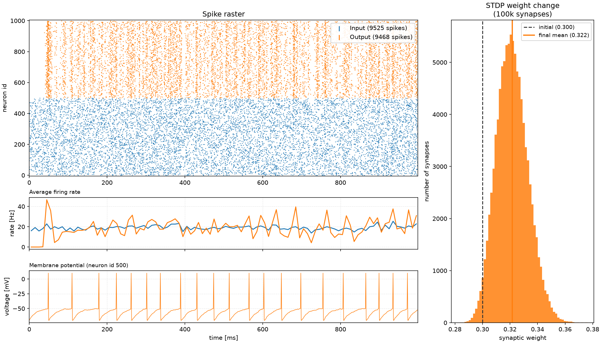

# Brain-CEL Spiking Neural Network Framework


## Installation

### Toolchain & System Dependencies

The project was verified to build and run with the following toolchain versions:

| Tool  | Verified | Minimum   |
|-------|----------|-----------|
| GCC   | 16.1.1   | ≥ 14      |
| CUDA  | 13.3     | ≥ 12.0    |
| CMake | 4.3.4    | ≥ 3.24    |


To install CMake, the Python development headers, and the C++ toolchain:
```bash
sudo apt update
sudo apt install cmake python3 python3-venv python3-dev build-essential
```

> **CUDA Toolkit**: Install the latest NVIDIA CUDA Toolkit from the official website:  
> [https://developer.nvidia.com/cuda-downloads](https://developer.nvidia.com/cuda-downloads)


### Build Instructions

1. Navigate to the project root
   
   ```
   cd /path/to/BrainCEL
   ```
2. Create build directory and compile
   
   ```bash
   mkdir -p build && cd build
   cmake ..
   cmake --build . -j$(nproc)
   ```

---
## Getting started

Initially, point a shell variable at your build directory (e.g. `cmake-build-release`):
   ```shell
   export BUILD=cmake-build-release
   ```

Then start your first Brain-CEL simulation from the `examples/quickstart/` directory.
   ```shell
   cd $BUILD/examples/quickstart
   ./quickstart
   ```

It simulates a two-layer network with 500 LIF neurons per layer for one second.
All weights are initially set at $w_{ij}(t=0) = 0.3$. Due to Spike-Timing-Dependent Plasticity (STDP) and a 
relatively high learning rate of $\eta =0.01$ we see the synaptic weight distribution soften even after 1 second of simulation: 



---

## Reproducing the Paper's Results

In the `examples/{nestcompare,ftcompare}/` directories, you find the scripts and executables to reproduce the evaluation figures from the paper. 

### Figure 3 (Brain-CEL vs. NEST)

```shell
cd $BUILD/examples/nestcompare
./nestcompare            # Brain-CEL benchmark → braincel_bench.txt
python nest_bench.py     # NEST benchmark      → nest_bench.txt
python visualize.py      # Visualize the data
```

### Figure 4 (Conventional STDP vs. FT-STDP)

```shell
cd $BUILD/examples/ftcompare
./ftcompare              # STDP-type Benchmark → braincel_bench.txt
python visualize.py      # Visualize the data
```

---

## License

BrainCEL is licensed under the **GNU Affero General Public License v3.0 or later**.
See the full license text  in [LICENSE](LICENSE).